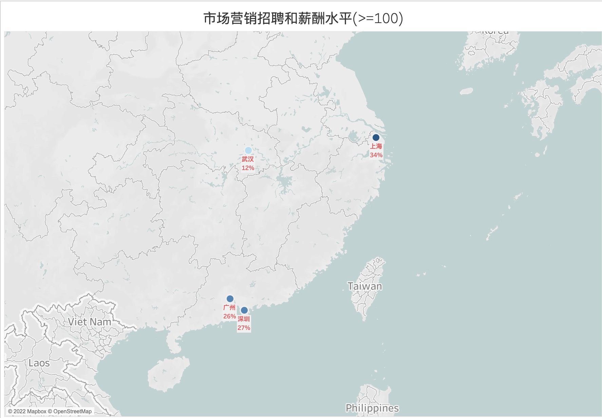
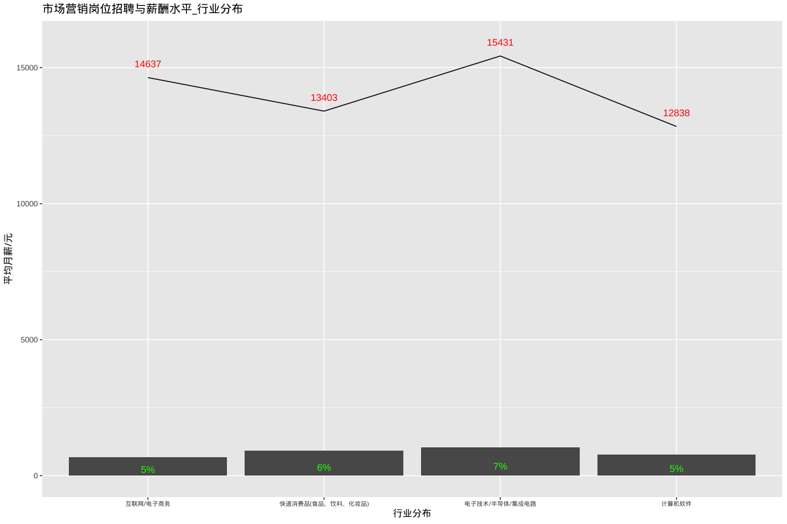
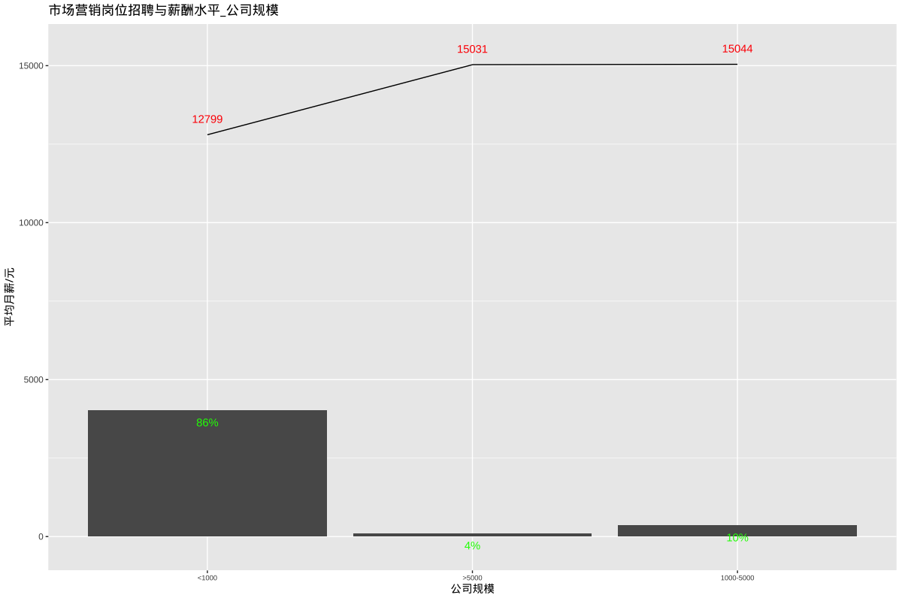
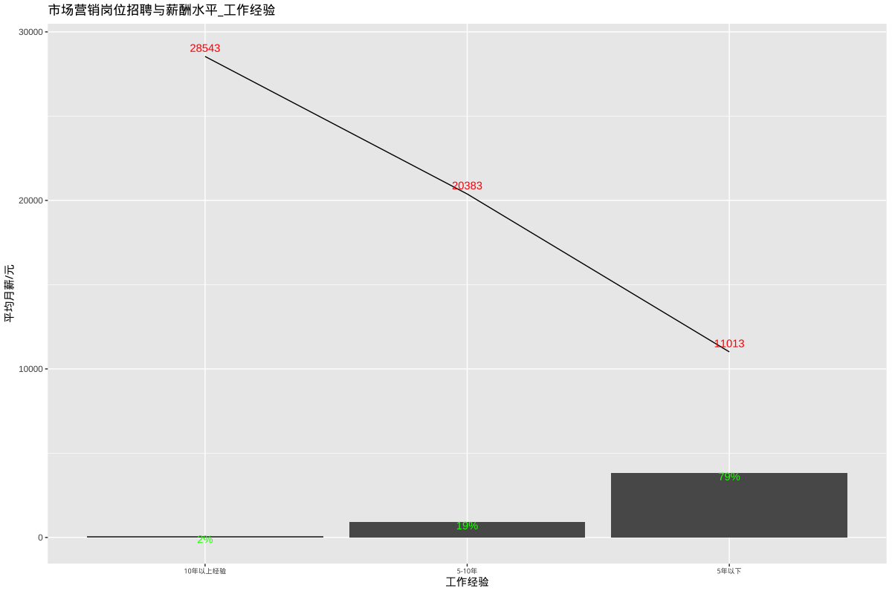
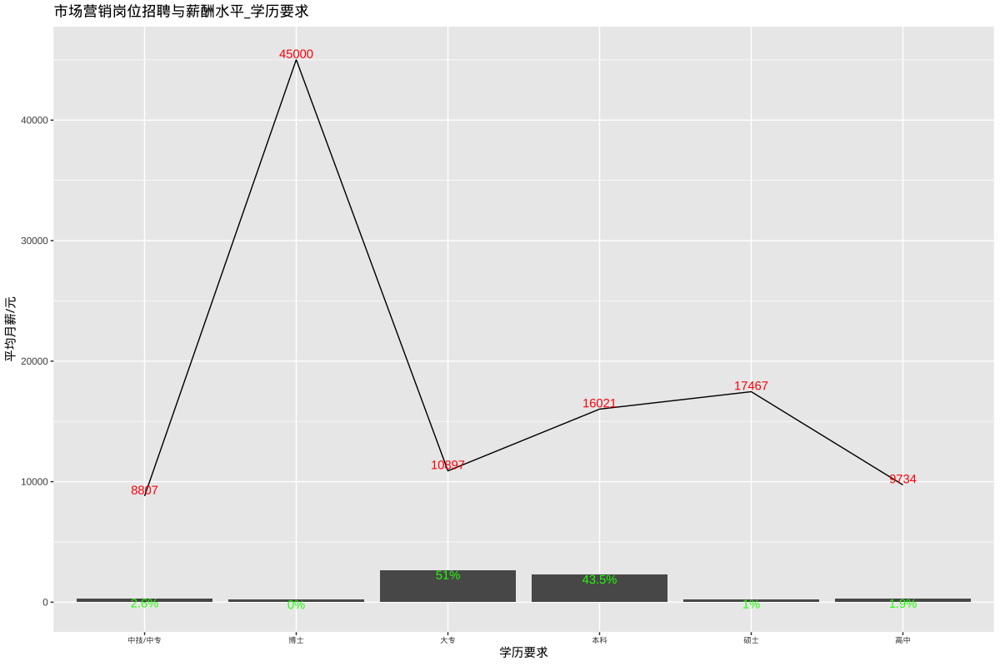

# 市场营销岗位招聘和薪酬水平

## 总述

本次采集有效数据4818条(城市发布量\>=100)，分析市场营销相关岗位招聘和薪酬水平，岗位如：市场总监、市场经理、专员或助理、品牌推广、SEO等，我们将从如下方面分析：

-   01.城市分布：上海、深圳、广州、武汉分别为34%（14632元），27%（13737元），26%（11797元），12%（10399元）。

-   02.行业分布：计算机软件占5%，平均月薪12838元；电子技术/半导体/集成电路占7%，平均月薪占15431元；快消品占6%，平均月薪13403元。

-   03.公司规模：1000人以下占86%，平均月薪12799元；1000-5000人占10%，平均月薪15044元。

-   04.公司类型：民企占70%，平均月薪12640元；外企占13%，平均月薪15184元。

-   05.工作经验：5年以下占79%，平均月薪11013元；5-10年占19%，平均月薪20383元。

-   06.学历要求：大专占51%，平均月薪10897元；本科占44%，平均月薪16021元。

## 01.城市分布

## 02.行业分布

## 03.公司规模

## 04.公司类型

## 05.工作经验

## 06.学历要求

